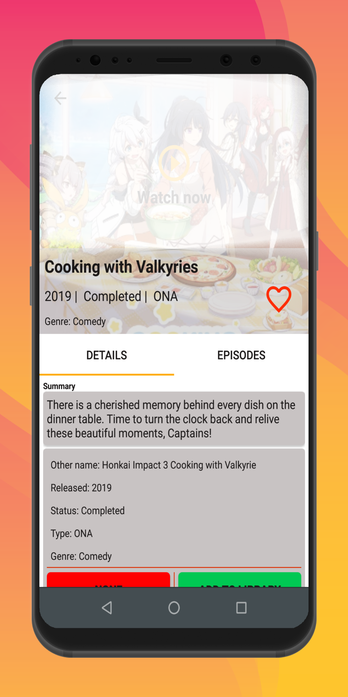
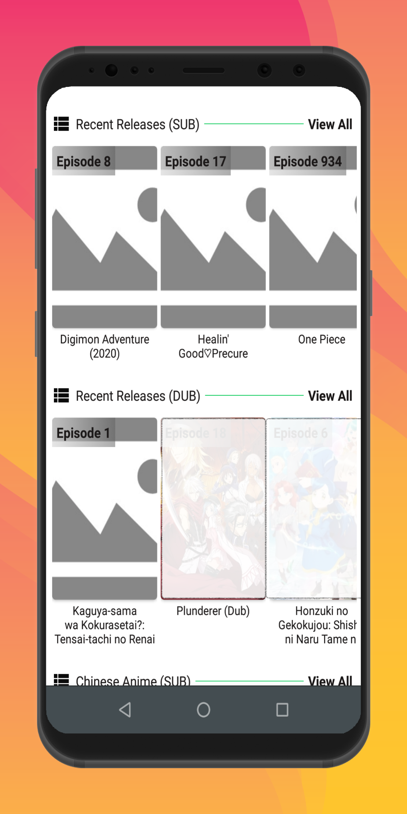
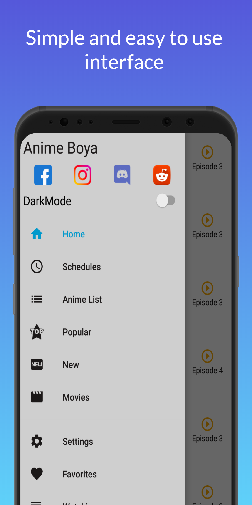
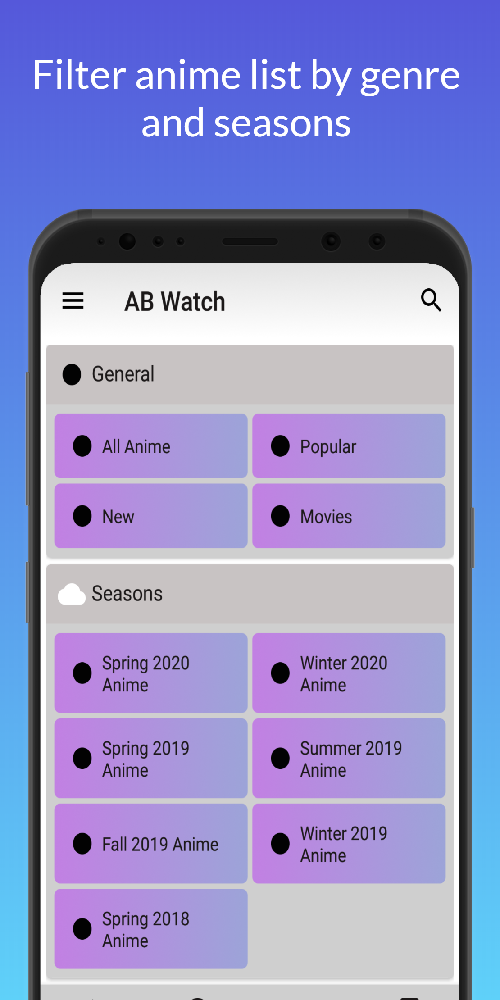
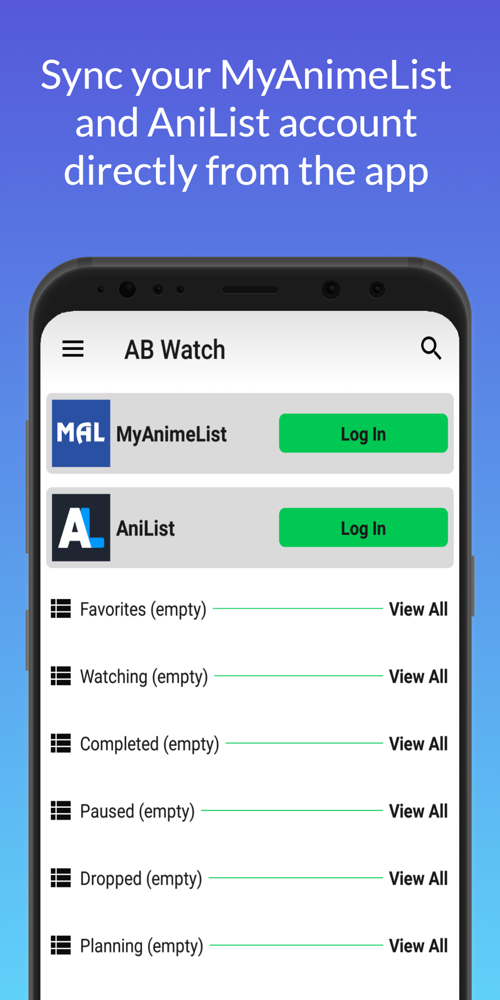

<image src="https://github.com/Tu2l/AnimeBoya/blob/master/20210417_180027.png" width=100 alt="animeboya">
<b>Icon designed by SAZIDISM</b>

<h2><b>UPDATE</b></h2>
<a href="https://github.com/Tu2l/AnimeBoya/releases/download/br12/masterRelease-1.043-build-210618123731.apk"><b> DOWNLOAD APK</b></a>

Report bugs and issues at <b>developer.tu2l@gmail.com</b>

Follow us on

<ul>
    <li><a href="https://facebook.com/animeboya"><b>Facebook</b></a></li>
    <li><a href="https://instagram.com/anime_boya"><b>Instagram</b></a></li>
    <li><a href="https://discord.gg/5kJ9SXC"><b>Discord</b></a></li>
    <li><a href="https://reddit.com/r/animeboya"><b>Reddit</b></a></li>
</ul>
<b>NOTE: Known Issue</b>

The app might crash while trying to download episodes in some devices, if this happens then please enable External Download Option from app settings.
I am trying to fix this issue as soon as possible.

    

version 1.043

<ul>
    <li>Download and Streaming error fixed for now</li>
</ul>

 

# Anime Boya: *Anime watching and downloading android app*

Free Anime streaming and anime downloading app developed by an Otaku (Anime fan) for other otakus. This app eliminates all the hassle and efforts required to watch your favorite Anime. Download any Anime just by clicking on download button and select your preferred quality.

   
   
   

## Download Anime

Just open an Anime by clicking on it and navigate to episodes tab and click on download button on any episode you want to download, the app will show you available the quality options from which you can select your preferred one.

## Stream Anime

Stream your favorite Anime in multiple quality options. You can use either the internal player or external player. There's also an option for **WebPlayer**

## Batch Download

Now you can download multiple episodes in your preferred quality option at a single click. You can download maximum of 12 episodes at once.

## Bookmarks

You can create your list directly in the app. You can add remove new anime to your list.
**Currently the following lists are available to the user:**
 - Favorites
 - Completed list
 - Watching list
 - Dropped list
 - Paused list
 - Planning list

## History

The app manages a history for the recently clicked anime. It will make easier to find recently opened anime.

## Schedule
Animeboya manages the schedules of ongoing anime.

## MyAnimeList and AniList Sync
Now sync your MyAnimeList and AniList libraries directly from Anime Boya.
You can:
 - Add Anime
 - Remove Anime
 - Update Anime
 - View your list

**Many more other features are implemented and will be implemented in the upcoming updates.**

[Download page](https://github.com/Tu2l/AnimeBoya/releases/latest)

***DISCLAIMER:**
*Copyrights and trademarks for the anime, and other promotional materials are held by their respective owners and their use is allowed under the fair use clause of the Copyright Law.* 

***NOTE:**  
*All trademarks and copyright protected to the respective owners. Content compiled from various public internet sources.*
